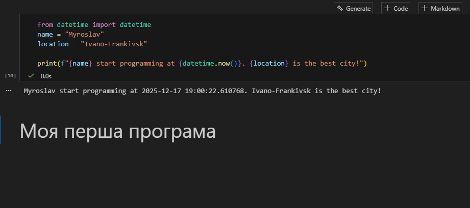
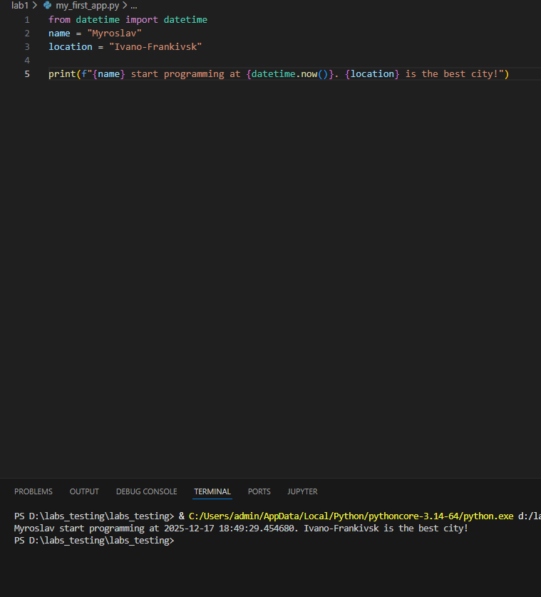

# Звіт до роботи
## Тема: Вступні заняття: налаштування середовища, прочаток роботи з Python та Markdown
### Мета роботи: Налаштувати середовище роботи VS Code, створити репозиторій Github та налаштувати інтеграцію з ним, написати першу програму на Python та створити звіт з використанням форматування Markdown;


---
### Виконання роботи
* Результати виконання завдання *1*;
    1. Розробили/Створили першу програму на Python.
    2. Програма вивела значення: Myroslav start programming at 2025-12-17 18:13:55.358292. Ivano-Frankivsk is the best city!
    3. Отримано наступні результати: Код у всіх випадках виконується.
    4. Навчилися налаштовувати середовище роботи VS Code, створювати репозиторій Github та налаштовувати інтеграцію з ним, писати першу програму на Python та створювати звіт з використанням форматування Markdown.
* вставлені рисунки 
    

* вставлений код / текстовий або числовий результат / інші результати:
```python
from datetime import datetime
name = "Myroslav"
location = "Ivano-Frankivsk"

print(f"{name} start programming at {datetime.now()}. {location} is the best city!")
```
---

### Перша програма ШІ та пояснення до неї
```python
name = input("Як тебе звати? ")
print(f"Приємно познайомитися, {name}! Я – проста програма, але вже можу взаємодіяти з тобою.")
```
Я без жодних труднощів міг би пояснити її роботу, оскільки вона складається з двох базових механізмів: спочатку програма зчитує текст, введений користувачем, і зберігає його у змінній, а потім формує фінальний рядок, підставляючи це значення у відповідь. У цьому простому прикладі вже видно логіку всієї роботи програмування: програма отримує дані, зберігає їх, а потім використовує для створення нового результату.

## Висновок

* У ході виконання роботи було організовано структуру репозиторію та створено окрему папку для всіх необхідних файлів. Було створено два файли: **my_first_app.py** та **my_first_app.ipynb**.
* Мету роботи досягнуто: навчилися налаштовувати середовище роботи VS Code, створювати репозиторій Github та налаштовувати інтеграцію з ним, писати першу програму на Python та створювати звіт з використанням форматування Markdown.
* Усі завдання виконані
* Складностей у виконанні завдання не виникло
* Такий формат є зручним