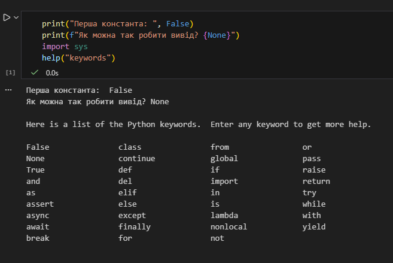
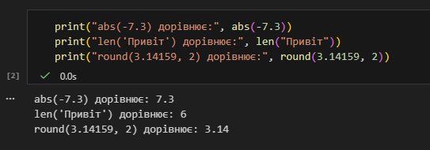
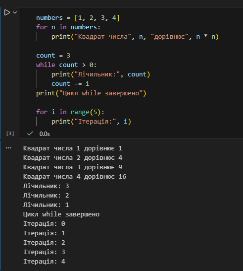
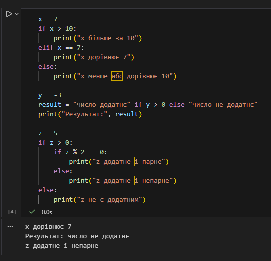
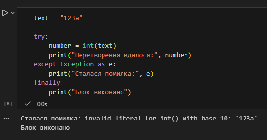
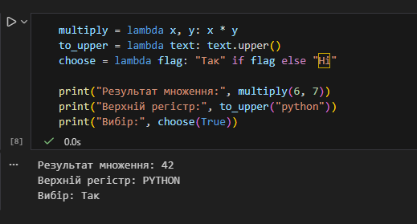

# Звіт до роботи
## Тема:Основи програмування на Python
### Мета роботи: Навчитись застосовувати основні конструкції мови Python, виконати всі приклади та з використанням AI створити власні приклади які демонструють особливості кодових конструкцій Pyhton

---
### Виконання роботи
* Результати виконання завдання *2*;
    1. Розробили різні програми Python.
    1. Програма вивела значення: 
    1. Отримав наступні результати: Усі приклади коду працюють, результат отримав у <<lab2_code.ipynb>>
    1. Навчилися застосовувати основні конструкції мови Python
* вставлені рисунки 
    
    

* вставлений код / текстовий або числовий результат / інші результати:

1. 
 ```python
a = "змінна з текстом"
b = 1 # числова Змінна
b1 = 1.1 
c = ["a", 1, 1.25, "Слово", a] # List
d = {"a": "Слово", "b": 1, a: b} # Dict
e = ("a", a) # Tuple
f = {"ss", a + b} # Set
```
2. 
```python 
print("Перша константа: ", False)
print(f"Як можна так робити вивід? {None}")
import sys
help("keywords")
```
3. 
```python 
print("abs(-7.3) дорівнює:", abs(-7.3))
print("len('Привіт') дорівнює:", len("Привіт"))
print("round(3.14159, 2) дорівнює:", round(3.14159, 2))
```
4. 
```python
numbers = [1, 2, 3, 4]
for n in numbers:
    print("Квадрат числа", n, "дорівнює", n * n)

count = 3
while count > 0:
    print("Лічильник:", count)
    count -= 1
print("Цикл while завершено")

for i in range(5):
    print("Ітерація:", i)
```

5. 
```python 
x = 7
if x > 10:
    print("x більше за 10")
elif x == 7:
    print("x дорівнює 7")
else:
    print("x менше або дорівнює 10")

y = -3
result = "число додатнє" if y > 0 else "число не додатнє"
print("Результат:", result)

z = 5
if z > 0:
    if z % 2 == 0:
        print("z додатне і парне")
    else:
        print("z додатне і непарне")
else:
    print("z не є додатним")
```

6. 
```python
text = "123a"

try:
    number = int(text)
    print("Перетворення вдалося:", number)
except Exception as e:
    print("Сталася помилка:", e)
finally:
    print("Блок виконано")
```
7. 
```python
with open("example.txt", "w") as file:
    file.write("Перша стрічка\n")
    file.write("Друга стрічка\n")

with open("example.txt", "r") as file:
    for i, line in enumerate(file, start=1):
        print(f"{i}: {line.strip()}")
```
8. 
```python
multiply = lambda x, y: x * y
to_upper = lambda text: text.upper()
choose = lambda flag: "Так" if flag else "Ні"

print("Результат множення:", multiply(6, 7))
print("Верхній регістр:", to_upper("python"))
print("Вибір:", choose(True))
```
---

## Висновки

* В роботі розроблено програми Python, в яких використовуються його основні конструкії
* Мети роботи досягнуто: навчились застосовувати основні конструкції мови Python, виконали всі приклади та з використанням AI створили власні приклади які демонструють особливості кодових конструкцій Pyhton
* Я дізнався про основні конструкції Python й навчився застосовувати ці знання на практиці.
* Всі завдання виконані
* Складностей у виконанні завдань не виникло
