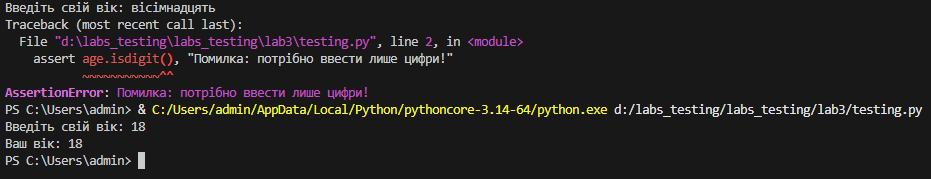
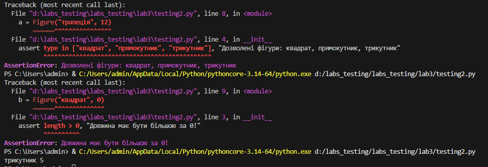
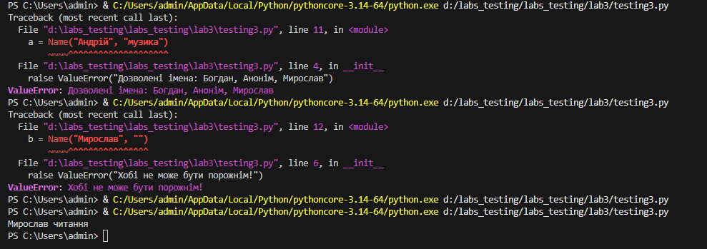
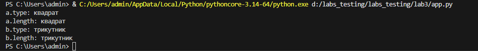
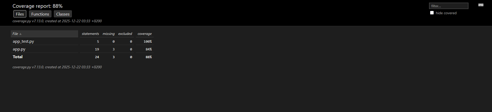

# Звіт до роботи
## Тема: Тестування
### Мета роботи: протестувати програму app.py різними методами


---
### Виконання роботи
* Результати виконання завдання *3*;
    1. Протестували app.py
    1. Програма вивела значення: 
    1. Отримав наступні результати: Програма працює правильно, код спрацював у всіх методах виклику.
    1. Навчився використовувати різні методи тестування
* вставлені рисунки 
    
    

* вставлений код / текстовий або числовий результат / інші результати:

### Перевірка assert

1. 
```python
age = input("Введіть свій вік: ")
assert age.isdigit(), "Помилка: потрібно ввести лише цифри!"
print(f"Ваш вік: {age}")
```

2. 
```python
class Figure:
    def __init__(self, type, length) -> None:
        assert length > 0, "Довжина має бути більшою за 0!"
        assert type in ["квадрат", "прямокутник", "трикутник"], "Дозволені фігури: квадрат, прямокутник, трикутник"
        self.type = type
        self.length = length

a = Figure("трапеція", 12)
b = Figure("квадрат", 0)
c = Figure("трикутник", 5)
print(c.type, c.length)
```

3. 
```python
class Name:
    def __init__(self, name, hobby) -> None:
        if name not in ["Богдан", "Анонім", "Мирослав"]:
            raise ValueError("Дозволені імена: Богдан, Анонім, Мирослав")
        if not hobby:
            raise ValueError("Хобі не може бути порожнім!")
        self.name = name
        self.hobby = hobby


a = Name("Андрій", "музика")
b = Name("Мирослав", "")
c = Name("Мирослав", "читання")
print(c.name, c.hobby)
```

### Юніт тести

1. 

```python
class Figure:
    FIGURES = ["квадрат", "прямокутник", "трикутник"]
    def __init__(self, type, length) -> None:
        assert length > 0, "Довжина має бути більшою за 0!"
        assert type in self.FIGURES, "Дозволені фігури: квадрат, прямокутник, трикутник"
        self.type = type
        self.length = length

    @property
    def get_figure_type(self):
        return self.type

    @property
    def get_figure_length(self):
        return self.type # робимо помилку

a = Figure("квадрат", 10)
b = Figure("трикутник", 5)

print("a.type:", a.get_figure_type)
print("a.length:", a.get_figure_length)

print("b.type:", b.get_figure_type)
print("b.length:", b.get_figure_length)
```
2. 

```python
import unittest
from random import choice, randint

from app import Figure # назва файлу з нашим класом повинна бути app.py

class TestFigure(unittest.TestCase):
    @classmethod
    def setUpClass(cls):
        """Виконається лише раз на початку тестів
        """
        pass
    
    def setUp(self) -> None:
        """Виконується кожного разу коли запускається тест
        """
        self.figure = choice(Figure.FIGURES)
        self.length = randint(1, 10)
        self.obj = Figure(self.figure, self.length)
        return super().setUp()

    def tearDown(self) -> None:
        del self.obj
        return super().tearDown()

    def test_figure_type(self):
        print(f"Тестуємо вивід, має бути: {self.figure} == {self.obj.get_figure_type}")
        self.assertEqual(self.figure, self.obj.get_figure_type, "Властивість get_figure_type повертає непривильну фігуру!")

    def test_figure_lengh(self):
        self.assertEqual(self.length, self.obj.get_figure_length, "Властивість get_figure_length повертає непривильну довжину!")
    
    def test_obj(self):
        with self.assertRaises(AssertionError):
            Figure("коло", 1) # Спробуємо створити обєкт з недозволеними параметрими, в нас має бути помилка AssertionError


if __name__ == '__main__':
    unittest.main() # unittest.main(verbosity=2) щоб був більш детальний вивід
```
### PyTest

```python
from app import Figure

def test_app_triangle():
    """Test if we create triangle figure.
    """
    fig = "трикутник"
    triangle = Figure(fig, 4)
    assert triangle.type == fig, f"Фігура має бути {fig}"
```
Результат: .
1 passed in 0.01s

### Візуалізація результатів та покриття коду Coverage

```python
from app import Figure

def test_get_angles():
    """Тестуємо чи правильно повертається кількість кутів фігури.
    """
    fig = "трикутник"
    triangle = Figure(fig, 1)
    assert triangle.get_angles == 3, f"У {fig} є 3 кути!"
```
---
### Висновок:

* В роботі розроблено програми Python, протестовано різними методами.
* Мети роботи досягнуто: навчились використовувати методи тестувань роботи програм.
* Я дізнався про основні методи тестувань коду у Python й навчився застосовувати ці знання на практиці.
* Всі завдання виконані
* Складностей у виконанні завдань не виникло
